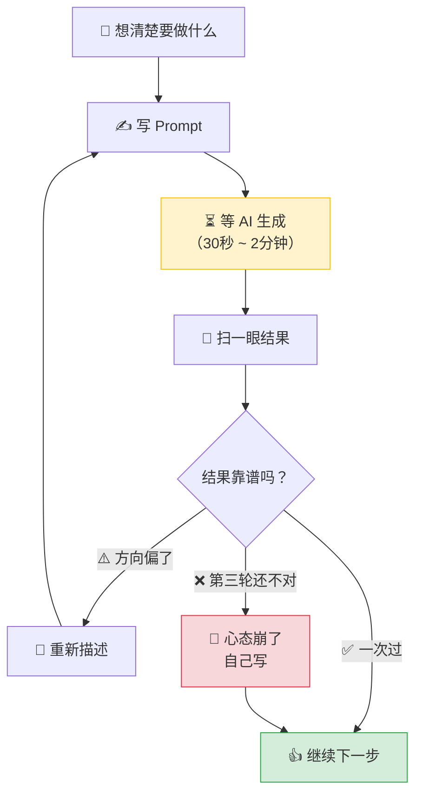

# AI写代码时，程序员在干嘛

> **摘要**：用 AI 写代码之后，程序员的工作节奏被打散了——从"专注敲代码的心流"变成了"发指令、等结果、检查、纠正、再等"的碎片循环。这篇文章不讲 AI 多厉害，就聊聊 AI 吭哧吭哧生成代码的那几分钟里，我们在干嘛，以及这种新节奏对程序员心态的实在影响。

如果你问我用 AI 写代码最大的改变是什么——不是写得更快了，是等得更久了。

以前写代码是一种心流。手指在键盘上飞，脑子里全是逻辑，变量名、方法签名、边界条件过一遍，手跟上去。中间最多去倒杯水，回来继续。那种状态很爽——你在掌控一切。

现在呢？一个对话框横在屏幕中间。你打完一句 Prompt，回车——然后等。

---

## 从连续剧变成了碎片

这种节奏的变化，比效率提升更值得聊。

传统的编码是连续的。打开 IDE，盯着代码，脑子里有一个清晰的执行路径，一行一行推进，中间穿插几次运行和调试。整个过程像在看一部电影——有起伏，但注意力是连贯的。两三个小时过去，你甚至没注意到时间。

AI 编码是碎片的。工作变成了：描述需求 → 等 AI 生成 → 检查 → 确认或修正 → 再描述 → 再等。每一轮之间都有一小段空白，你被不停地从专注状态里拉出来、塞回去、再拉出来。

这个空白有多大？我算过。

假设你一天跟 AI 交互 80 次（重度 AI 编码的话这不算夸张），每次等 30 秒到 1 分钟。一天下来，在"等 AI 跑完"这件事上花了 40 到 80 分钟。这还算的是"跑得顺"的情况——没算 AI 卡壳、你需要重新描述、或者它生了一大坨你得仔细读的时间。

80 分钟什么概念？差不多是你一天有效工作时间的五分之一，就这么消失了。

---

## 等待的时候，你真正在干嘛

不要美化这段等待时间。

有一些文章说"可以利用 AI 生成的间隙思考架构"。说实话，30 秒够想什么架构？你刚把上一轮的上下文从脑子里卸下来，AI 的结果就出来了。这点时间根本进不了深度思考。

真实情况是——

切到微信看一眼。工作群有没有新消息？朋友群里在聊什么？嗯，刷过去，没大事。

切回来，AI 还在跑。

再切出去，看一眼 Twitter。又切回微信。刷一下即刻。喝口水。站起来走两步，又坐回去。

有时候你甚至忘了刚才让 AI 改的什么。结果出来了，你得盯着屏幕上的一大坨代码，先回忆一下上下文，再开始看它到底改没改对。

这不是"高效利用碎片时间"。这就是走神。

而且有一个很微妙的地方：**这段时间很难被你自己记入"工作时间"**。你不会跟同事说"我今天写了六小时代码，其中三小时在等 AI"。但你确实在工位上，确实在处理工作，确实没有休息。这种"既没在认真写代码、也没在休息"的中间状态，是最消耗精力的。

---

## AI 改不好的几种翻车场景

等一等也就算了，更让人崩溃的是——等了半天，出来的东西不对。

用了 AI 编码一年多，我遇到了几种翻车模式。

### 模式一：方向歪了

你让 AI 改 A。它把 A 改了，顺便把 B 也改了。B 改得还行——但你没说让它改 B 啊。行，算了，反正 B 确实可以优化一下。

然后你发现它把 C 也动了。C 改出了一个 bug。你跟它说"C 不对，改回去。"它改了，又顺便把 A 给动了。

这种事情发生一次还好，两次你就开始烦躁。第三次你会想把键盘摔了。

### 模式二：来回拉锯

第一版：不是你要的。

你说"不是这样，我要 XXX"。第二版：另一个方向，还是不对。

你耐着性子重新描述需求，把边界条件列清楚。

第三版：跟第一版差不多。

这时候你会开始怀疑——是我的 Prompt 写得不够好，还是 AI 在这个场景下就是理解不了？你甚至会怀疑自己的表达能力——明明很简单的东西，怎么说都说不明白呢？

### 模式三：修一个，引入一个

这是最常见的。你让 AI 修 bug A，A 修了，但引入了 bug B。让它修 B，B 修了，C 出来了。像打地鼠，永远打不完。

```java
// 让 AI 修一个空指针异常，第四轮的产物
public String formatCreateTime(Order order) {
    if (order == null || order.getCreateTime() == null) {
        return "--";  // NPE 确实修了
    }
    return order.getCreateTime()
        .atZone(ZoneId.of("UTC"))  // AI：UTC 比较"安全"
        .format(DateTimeFormatter.ISO_LOCAL_DATE_TIME);
    // 对着呢？对。但这是面向中国用户的后台系统
    // 时区错了，凌晨的数据会偏差 8 小时
}
```

这种代码你扫一眼可能就过了——NPE 确实修了啊。但时区问题会在某个你睡觉的时间找到你。

### 模式四：还是我自己写吧

明明很简单的东西，AI 就是改不对。你盯着屏幕，开始思考一个深刻的问题：我要不自己写，两分钟就搞定了，但它已经耗了我十分钟了，现在放弃是不是亏了？

沉没成本让你没法停下来。于是你又发了一轮 Prompt。它还是不对。

你终于认输了，关掉对话框，自己写。写完一看时间——半小时过去了，其中二十分钟是跟 AI 拉扯。

---

## 成就感也在变

说实话，AI 编码效率是有的。那些重复的、模板化的东西——CRUD、单元测试、配置文件、文档注释——丢给 AI，省的时间是真的。

但有些东西在悄悄改变。

以前写完一个复杂的功能，调试通过，跑起来，那种"我写出来了"的满足感很直接。现在呢？你对 AI 描述了需求，它生成代码，你检查一遍，通过。感觉更像是"AI 写出来了，但我审核过了"。

你从一个**创作者**变成了一个**审核者**。审核者听起来更高端，但体验并不更好。那种从零建造一个东西的乐趣，在"发指令 → 检查 → 通过"这个流程里被稀释掉了。

还有一件事让我有点不安：**技能的微妙退化**。有些以前自己写得很熟的代码，现在习惯性丢给 AI。"反正 AI 能写"——但你真的还能手写出来吗？不是说忘记语法，语法忘不了。是那种从零构建逻辑链路的能力，会不会因为长期"审阅而非创作"而变钝？

我上次自己手写一个复杂的 Stream 操作链，写到一半愣了一下——以前这种代码随手就来的。

还有一个更隐蔽的问题：**对复杂逻辑的耐心变差了**。以前写复杂逻辑，会沉下来认真想清楚每一步。现在习惯性先把需求丢给 AI 看看它怎么处理。它处理不好，你才开始自己思考。但来回几轮之后，精力已经消耗了不少在生产 Prompt 和纠正 AI 上，真正需要深度思考的时候反而没力气了。

---

## 其实问题在这儿

说到底，不是 AI 的问题，是工作模式变了。

以前你和代码之间的关系是**直接**的。脑子里想清楚，手上写出来，编译通过，跑起来——整个过程是闭合的，有始有终，节奏你自己控制。

现在代码变成了一种**间接产出物**。你不是直接建造它的人，你是那个描述需求、检查结果、确认交付的人。AI 在中间充当了一层代理——这层代理确实快，但也把原本连续的工作过程切成了碎块。



这张图可能比我上面说的所有话都精确——AI 编码的核心体验不是"AI 帮你写"，而是你被塞进了一个**循环**里。这个循环的主旋律不是敲键盘，是等。

每次循环的时间不长，但次数多了，累积起来的等待和来回纠正，比你想象的多得多。

---

## 别慌，有几个笨办法

我不想把这篇写成"AI 不好别用"。AI 有用，而且会越来越有用。问题是，怎么在这种碎片化的节奏里，保持你自己作为程序员的效率和心态。

我试了一堆方法之后，现在大概是这么做的：

**第一，复杂逻辑自己先理清楚。**

不要让 AI 替你做架构决策。一个功能如果你自己都没想清楚边界条件和数据流，AI 更不可能在第一次就猜对。花五分钟在脑子里过一遍，画个草图——哪怕就是纸上画几个框——然后把明确的需求交给 AI，让它帮你填实现。这样做，改动的轮次明显会少。

**第二，小任务直接丢，过了就过。**

格式化、简单的转换、标准 CRUD——这些东西 AI 大概率一次就写对。扫一眼，没问题就过。别纠结"是不是可以写得更优雅"，省下来的精力留给真正需要动脑子的部分。

**第三，AI 卡三次，自己写。**

这是一个硬规则，我自己定了以后就再也没破过。同一个问题，AI 改了三轮还不对——停，不要再试第四轮。你已经在这个问题上跟 AI 耗了至少五分钟，而三轮下来，你对这个问题的理解已经够了。自己写，通常比再发一轮 Prompt 更快。

**第四，等待时间别刷手机。**

最难的其实是这条。那几十秒你本能地就想切到别的窗口。但每次切回来，你都要重新加载上下文——刚才在改什么、为什么改这个、AI 上一轮是怎么写的——这个加载成本比你以为的高得多。我现在尽量趁那几十秒看上一轮 AI 的输出，或者想想下一步要做的事。坦白说不是每次都能做到，但尽量。

---

## 最后

用了 AI 编码快两年，最深的感受不是"效率提升了多少"，而是：**AI 没有让我变成一个更强的工程师，但它彻底改变了我和代码之间的关系。**

以前是两个人——我和代码。我写，它跑，我们之间是直接对话。

现在是三个人——我、AI 和代码。我是那个传达需求的人，AI 是那个实现的人，代码是那个最终产物。我从建造者变成了中间人。

中间人这个角色，操的心一点都不比建造者少。你要不停地切换注意力、管理对话上下文、判断结果质量——这些消耗的脑力，不比你亲自写代码少。

等 AI 跑完的那几十秒，你看起来什么都没干。但你依然在工位上，依然是那个出了问题要被叫起来的人。你依然是那个对代码负责的人。

这点没变，以后大概也不会变。

**作者：唐悦玮 ｜ 公众号同名**
> 从后端出发，用 AI 拓展到全栈的工程师。
