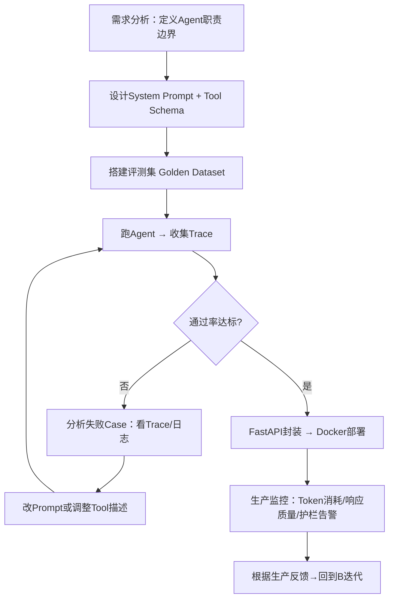

# AI智能体开发的正确姿势

> **摘要**：AI Agent 是 2026 年最火的技术方向，招聘市场技能需求也日渐清晰——LangChain、RAG、MCP、多智能体协同。做了十年 Java 后端，我翻了翻招聘 JD 和开源项目，弄清楚了后端转 Agent 开发到底要学什么、怎么学、日常开发跟传统软件有什么区别。不是劝你转行，纯把路况说清楚。

---

最近半年，AI Agent 这个词出现频率高得离谱。技术博客在写、开源项目在更新、招聘网站上冒出来一堆"AI Agent 开发工程师"的岗位。

我好奇，就去翻了翻这些 JD 在要求什么技能。翻完发现一件事：AI Agent 的技术栈已经形成了一套明确的体系——LangChain、RAG、MCP 协议、多智能体协同——不再是零散的碎片，而是一条有头有尾的学习路径。

我把这条技术栈梳理了一遍。这篇文章就是把梳理的结果摊开——不是劝你转行，是告诉你这条路长什么样、哪段好走、哪段有坑。

---

## AI Agent 到底是什么

聊技能之前，先把概念对齐。

很多人以为 AI Agent 就是"更聪明的 ChatGPT"。不对。

ChatGPT 是问答模式——你问一句，它答一句，答完就结束了。AI Agent 是自主行动模式——你给它一个目标，它自己分解任务、调用工具、做决策、执行、检查结果，不行就重来。

举个例子：你让 ChatGPT "帮我查一下下周去北京的机票"，它会说"我没办法访问实时数据，建议你去携程查"。你让一个接入了机票 API 的 AI Agent 做同样的事，它会自己调携程的接口、对比价格、考虑你的偏好（比如不喜欢早班机），然后把 Top 3 方案列出来，附上理由。

区别在哪？ChatGPT 是脑子，AI Agent 是脑子 + 手。

再往深一层：单个 Agent 能干的事其实有限。真正在生产环境里跑起来的，通常是多 Agent 协作——一个 Agent 负责理解用户意图，一个负责查数据库，一个负责调外部 API，还有一个负责检查结果质量。它们之间通过 MCP（Model Context Protocol）和 A2A（Agent-to-Agent）协议通信。

对于后端工程师来说，这个概念其实不陌生。Agent 本质上就是一个**有 LLM 大脑的微服务**——它接收请求、调用下游服务、返回结果。只不过以前你写死的是 if-else 逻辑，现在 Agent 自己决定调哪个工具、传什么参数。

---

## 招聘市场到底要什么

我把 BOSS 直聘上 2026 年 6 月的 AI Agent 开发 JD 翻了一些，结合开源项目 [ai-agents-from-zero](https://github.com/didilili/ai-agents-from-zero) 整理的技能树，拉了一张表。全球 AI 人才需求同比增长 45%（来源：aixuexiquan.com），这个方向的需求量很大。

先看硬技能要求：

| 维度 | 要求 | 对十年 Java 后端的难度 |
|------|------|----------------------|
| 编程语言 | Python（必须），Java（加分） | ⭐⭐ 低。Java 程序员学 Python，2-3 周够用 |
| 框架 | LangChain、LangGraph、LlamaIndex | ⭐⭐⭐ 中。概念新，但本质是链式调用和状态管理 |
| 协议 | MCP、A2A | ⭐⭐ 低。本质是标准化 API 协议，类似你熟知的 REST/gRPC |
| 知识体系 | RAG、Prompt 工程、Tool Calling、向量数据库、多智能体 | ⭐⭐⭐⭐ 偏高。RAG 和多智能体需要实战积累 |
| 模型理解 | LLaMA/Qwen/GPT，理解 Transformer/MoE 原理 | ⭐⭐⭐ 中。不用手写反向传播，但得懂架构差异 |
| 低代码平台 | Coze（扣子）、Dify | ⭐ 极低。拖拽式，半天上手 |
| 部署 | Docker、Ollama、vLLM、FastAPI | ⭐⭐ 低。Docker 你本来就会 |
| 微调 | LoRA、QLoRA、Llama-Factory | ⭐⭐⭐⭐ 偏高。需要 GPU 资源和实验时间 |

你会发现一件事：对Java 后端来说，真正需要"从零学"的东西其实不多。Python、Docker、API 设计这些你已经有基础。真正的挑战集中在三个地方：**RAG 检索增强生成**、**多智能体协同**、**模型微调**。其他都是"换个工具干同样的事"。

---

## 从零到能干活的学习路线

开源项目 [ai-agents-from-zero](https://github.com/didilili/ai-agents-from-zero) 整理了一条 6 阶段的学习路线，到 2026 年 6 月已经完成了概念篇和两个完整实战项目。我按自己的理解，把每个阶段真正会遇到的问题说一下。

### 第一阶段：大模型基础（2-3 周）

别一上来就啃 Transformer 论文。正确的顺序是反过来的：先用起来，再回头看原理。

装一个 Ollama，把 Qwen 或 LLaMA 拉到本地跑起来。看到模型在本地吐出第一个字的时候，你对"大模型"的理解会变——它不再是一个论文里的概念，而是一个跑在你机器上的程序。这时候再去看 Transformer 的自注意力机制、MoE 的专家路由，你会觉得"哦，原来是为了解决这个问题"。

Prompt 工程也是这个阶段的事。说白了就是学会跟模型好好说话——什么指令格式效果好、怎么给 few-shot 示例、怎么约束输出格式。这个技能在你后面的所有开发里都会用到。

### 第二阶段：低代码平台（1-2 周）

花一两天把 Coze 或 Dify 玩一遍。拖一个工作流出来，接个知识库，配个插件，看看一个最简单的 Agent 是怎么跑起来的。

这个阶段的目的是**建立直觉**。你不用写一行代码就能看到一个 Agent 的完整行为链路——用户输入 → 意图识别 → 知识库检索 → 工具调用 → 结果汇总 → 输出。这对后面手写 Agent 代码非常有帮助，因为你脑子里已经有了"成品长什么样"的画面。

### 第三阶段：核心开发框架（3-4 周）

LangChain 是绕不开的。但很多人学 LangChain 的方式有问题——一上来就看文档把所有模块过一遍，看到一半就放弃了。

更好的方式是带着一个问题去学：**"我要做一个能查数据库的对话机器人"**。然后顺着这个目标去翻 LangChain 的 Model I/O、Memory、Tools、Agent 这几个模块。每学一个模块就动手写一段——比如用 `create_react_agent` 注册一个自定义 Tool，让 Agent 能查订单状态，跑通了就有体感了。

LangGraph 比 LangChain 重要。因为它解决的是 Agent 开发的核心难题——**状态管理和流程控制**。传统的 Chain 是线性的，LangGraph 是图式的：节点代表处理步骤，边代表决策分支。一个客服 Agent 可能是"先查意图 → 意图是查订单就走订单分支 → 意图是退款就走退款分支 → 最后汇总"。这种分支逻辑用图来表达非常自然。

MCP 协议是这个阶段的另一个重点。你可以把它理解成"AI 时代的 REST API"——它定义了 Agent 怎么发现工具、怎么调用工具、怎么处理工具返回的结果。Anthropic 2024 年底提出这个协议后，几乎成了行业标准。

### 第四阶段：RAG 和 Agent 实战（3-4 周）

这个阶段是最容易让人怀疑人生的。

RAG（检索增强生成）听起来很简单：把文档切成块 → 向量化存起来 → 用户提问时检索相关块 → 塞给 LLM 生成答案。但实际做起来全是坑。

切块切多大？太小了语义不完整，太大了检索精度差。用什么 embedding 模型？BGE 还是 GTE？检索回来了 10 个块，怎么重排序？多路召回怎么融合？用户问"上个月的订单"，你怎么把"上个月"转成具体的日期范围去查数据库？

企业级 RAG 的真实架构比教程里复杂得多：多路召回（关键词 + 向量 + 结构化查询）→ BGE-Rerank 重排序 → 上下文压缩 → LLM 生成。每一步都有大量细节要调。

多智能体协同是这个阶段的另一个重头戏。你开始让多个 Agent 协作——一个负责搜索、一个负责分析、一个负责校验。A2A 协议定义了 Agent 之间的通信标准。这个阶段如果你能把 DeepAgents 的深度研搜项目跑通一遍，基本就出师了。

### 第五阶段：部署与微调（2-3 周）

FastAPI 封装 Agent 服务，Docker 打包，vLLM 做模型推理加速。这部分对后端工程师来说其实不难——你每天都在干类似的事。

微调是个深坑。LoRA/QLoRA 让你可以在消费级 GPU 上微调 7B 参数的模型，Llama-Factory 把微调流程简化到了几行命令。但真正难的是准备训练数据——什么样的数据能提升模型在你的场景下的表现？数据配比怎么定？过拟合了怎么办？这个阶段建议先用开源数据集跑通流程，再尝试自己的场景。

### 第六阶段：项目实战

把前面学的东西串起来。ai-agents-from-zero 提供了两个完整的实战项目：电商问数系统（NL2SQL + LangGraph）和深度研搜（DeepAgents 多智能体）。把这两个项目从头到尾做一遍——理解每一行代码的意图，而不是复制粘贴跑通就行。

---

## AI Agent 日常开发到底怎么干

这里我想讲一个很多教程不讲的东西：Agent 开发的日常节奏和传统软件开发完全不一样。

### 传统开发 vs Agent 开发

传统后端开发是你写代码，编译器跑，结果确定。如果出 bug 了，加断点，一步步跟，找到问题，改一行代码，再跑——确定性很高。你写一个 `if (order.status == "paid")`，它永远在那个条件下进去。

Agent 开发不是这样。你写的是 Prompt 和 Tool Description，Agent 自己决定调哪个工具、传什么参数、怎么理解用户意图。同一个 Prompt，面对同一个用户输入，Agent 可能每次的行为都不一样。**不确定性是 Agent 开发最大的敌人。**

下面是一个典型的 AI Agent 日常开发流程：

看着是不是跟传统的"写代码 → 编译 → 单测 → 部署"有点像？但每一步的内涵完全不同。

### Prompt 调试：花 30-40% 的时间在这上面

在传统开发里你不会花 30% 的时间写注释。但 Agent 开发中，**Prompt 和 Tool Description 就是你的代码逻辑**。你得反复调——System Prompt 的措辞、Tool 的描述文案、示例的覆盖度。

举个例子。你写了一个查询订单的 Tool，Description 写的是"查询订单信息"。Agent 有时会调用它，有时不会。你改成了"根据订单号查询订单状态，返回订单的物流信息、支付状态和预计送达时间"，调用准确率就从 70% 跳到了 95%。因为 LLM 是靠语义匹配来决定调哪个工具的，描述越具体，匹配越准。

### 调试靠 Trace，不靠断点

Agent 的行为链路是：用户输入 → LLM 推理 → 决定调用 Tool A → Tool A 返回 → LLM 再推理 → 决定调用 Tool B → 汇总输出。中间任何一步出错，最终结果都不对。

你没法在这条链路上打断点。你只能靠 LangSmith 或 Langfuse 这类追踪工具，看每一步的输入输出是什么、LLM 当时是怎么决策的。

一个真实的调试场景：Agent 在回答"最近有哪些退款订单"时调了三次数据库——先查所有订单，再查退款订单，再查一遍所有订单。通过 Trace 发现是 Prompt 里少了一句"优先用退款状态筛选而不是遍历"，加上之后一次查询就搞定了。

### 评测靠数据集，不靠手工测

传统开发你写几个 JUnit 用例，跑过了就上线。Agent 不行——同一个问题问法不同，Agent 行为可能完全不同。所以你得先构建一个 Golden Dataset：50-100 个典型的用户问题，每个配好期望的答案。每次改了 Prompt，先跑一遍评测集，看通过率是升了还是降了。

这套流程跑通了之后，你对 Agent 的行为就有了信心——不再是"我觉得它表现不错"，而是"评测集通过率 92%，可以上线"。

---

## 后端工程师怎么开始

如果你也想试试这个方向，我的一些建议：

**Python 不是障碍**。Java 程序员学 Python 非常平。变量、循环、函数这些 3 天上手，列表推导式和装饰器 1 周够用，FastAPI 写接口跟 Spring Boot Controller 差不多。2-3 周能到做 Agent 开发的程度。

**第一个项目别贪大**。做一个"能查数据库的自然语言问答"就够了。技术栈：FastAPI + LangChain + MySQL + Ollama（本地跑 Qwen 7B）。整个项目 300 行代码出头，跑通 Agent 开发全流程。

**三个建议**：第一，别一上来就啃 Transformer 数学推导，先用起来再回头看原理；第二，别迷信 Coze/Dify 的低代码能力，它们适合快速验证想法，但生产级 Agent 还得手写；第三，别在微调上花太多时间——Prompt 优化 + RAG 调优对 95% 的场景够用了，成本也低得多。

**关注两个协议**：MCP 和 A2A 是 AI Agent 的基础设施，就像 HTTP 之于 Web。早了解早受益。不为了什么，就为了保持对技术趋势的敏感——后端工程师这行，不跟技术演进就是退化。

---

**作者：唐悦玮 ｜ 公众号同名**
> 从后端出发，用 AI 拓展到全栈的工程师。
